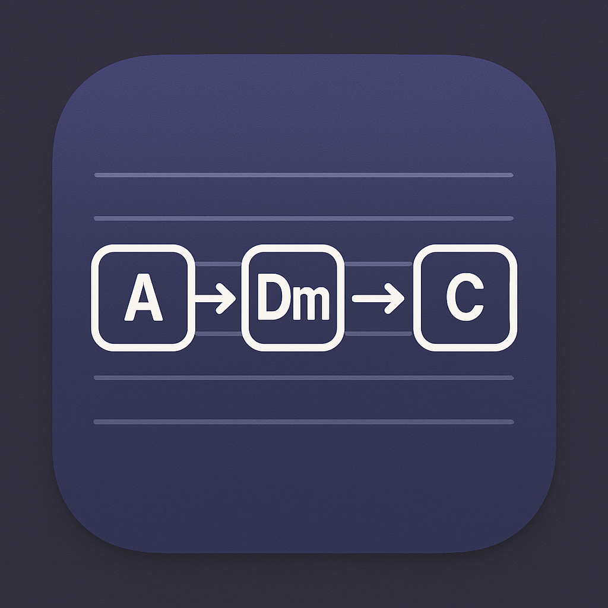
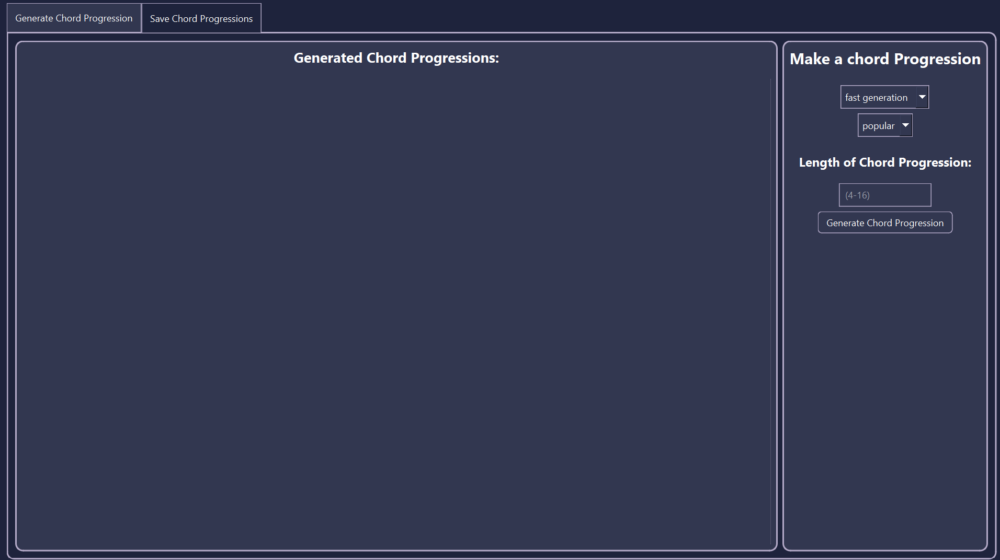

# 🎵 Chord Progression Generator

<p align="center">
  
</p>

A desktop application built with PyQt6 that generates chord progressions using Markov chain models trained on a dataset of musical chord sequences.



## ✨ Features

- **🤖 AI-Powered Generation**: Uses Markov chain models to generate realistic chord progressions
- **⚡ Dual Generation Modes**:
  - **🚀 Fast Generation**: Trains on 10,000 lines for quick results
  - **🐢 Slow Generation**: Trains on 100,000 lines for more diverse progressions
- **📏 Customizable Length**: Specify the number of chords in your progression (1-20 chords)
- **💾 History Management**: Automatically saves generated progressions to a local SQLite database
- **🔄 Multi-threaded Processing**: Non-blocking UI with background generation using thread pools
- **🎨 Modern Interface**: Clean UI built with PyQt6
- **🔊 Audio Playback**: Play generated chord progressions with proper octave handling

## 🔧 How It Works

### Architecture Overview

The application consists of four main components:

1. **Data Generation** (`data/data.py`):
   - Reads chord sequences from a zipped dataset
   - Builds a Markov chain model using the markovify library
   - Generates new chord progressions based on statistical patterns learned from training data
   - Supports two training modes:
     - **Fast**: 10,000 lines for rapid generation
     - **Slow**: 100,000 lines for more diverse and complex progressions

2. **Audio Synthesis** (`audio/music.py`):
   - Converts chord names (e.g., "Cmin", "G7") to MIDI note sequences
   - Handles enharmonic equivalents and proper octave positioning
   - Generates audio waveforms and plays chords concurrently using pygame

3. **Database** (`database/db.py`):
   - SQLite-based persistent storage for generated progressions
   - Stores, retrieves, and deletes chord progression history
   - Enables users to track and manage past generations

4. **User Interface** (`app/`):
   - **Generation Tab**: Create new chord progressions with customizable parameters
   - **History Tab**: View, play, and manage previously generated progressions
   - Multi-threaded processing to keep the UI responsive during generation

### Generation Process

1. User selects generation mode, chord count, and clicks "Generate"
2. A background thread loads chord sequences from the dataset
3. Markovify builds a statistical model of chord transitions
4. New progressions are generated by sampling likely chord sequences
5. Results are displayed and automatically saved to the database
6. User can play, copy, or delete progressions from the history

## 📋 Prerequisites

- Python 3.8+
- PyQt6
- markovify
- librosa
- numpy
- scipy
- pygame
- SQLite3 (included with Python)

## 🚀 Installation

1. Clone the repository:
```bash
git clone https://github.com/yourusername/Chord-Progression-App.git
cd Chord-Progression-App
pip install PyQt6 markovify librosa numpy scipy pygame
```

## 🎮 Usage

```bash
python main.py
```

